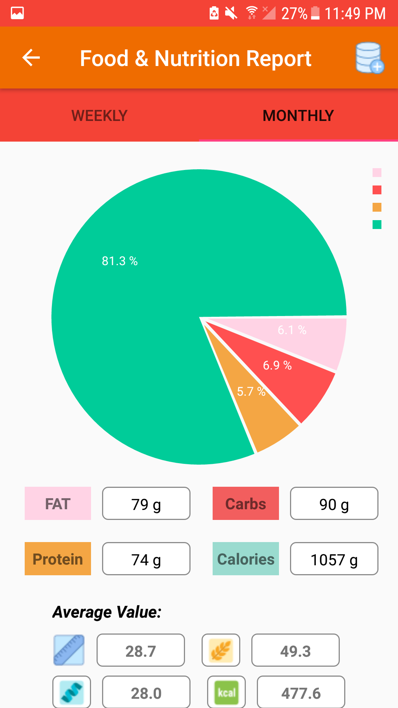

# FitnessNew
It is an university project in which the user can see their total steps taken, walking time, running time, calories burned, and distance covered in a day along with the progress reports. Also users are able to add the food item that they have consumed during the whole day in the meal planner section of this application.

The application provides four main user functionalities, namely, the activity tracker, meal planner, reports, and health blog.  
(1) The Activity Tracker is used for tracking the user steps including the walking, running and stairs time along with the total step taken in a day. 
(2) The Meal planner activity is used to get the suggested meal plans with the help of the user's general information (Height, Weight, Gender, Age, and Body fat) and the food ontology database APIs. This functionality also allows the user to add foods manually using text search and voice search. 
(3) The third feature, Progress Report activity is used to present the weekly and monthly reports of the activity tracker and nutrients consumed by the user in the form of a line and pie chart. Moreover, the user can also see his/her weekly progress for the activity tracker and meal planner by just clicking the icons on the activities in the form of bar chart as well as a daily report in a list format.
(4) The last activity is the health blog which can be used to see different blogs available online related to the health and life improvement.

